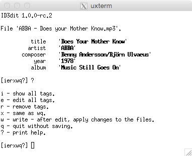

# ID3dit

[ID3](https://en.wikipedia.org/wiki/ID3) tags editor for the command line written in Ruby.




## Install

The preferred method of installation is via RubyGems.org:  
<https://rubygems.org/gems/id3dit>

```bash
gem install id3dit
```

or via `Gemfile`:

```ruby
gem 'id3dit', '~>1.1'
```

## Usage

Video: <https://asciinema.org/a/a3tt619cc1r529av8skskgz5w>

### Print Help

```bash
id3dit -h
```

### Interactive Mode

```bash
id3dit FILES...
```

### Set Tag

```bash
id3dit --artist STRING FILES...
```

### Remove All Tags

```bash
id3dit --remove-all FILES...
```

### Remove a Tag

```bash
id3dit --remove-comment FILES...
```

### Examples

- `id3dit my_music.mp3`
- `id3dit track01.mp3 track02.mp3`
- `id3dit --artist EAV track01.mp3`
- `id3dit --artist AC/DC *.mp3`
- `id3dit --year 1987 --bpm 180 track01.mp3`
- `id3dit --remove-all track01.mp3`
- `id3dit --remove-comment track01.mp3 track02.mp3`
- `id3dit --remove-disc --remove-track track01.mp3 track02.mp3`

## Project Links

- [Gem](https://rubygems.org/gems/id3dit)
